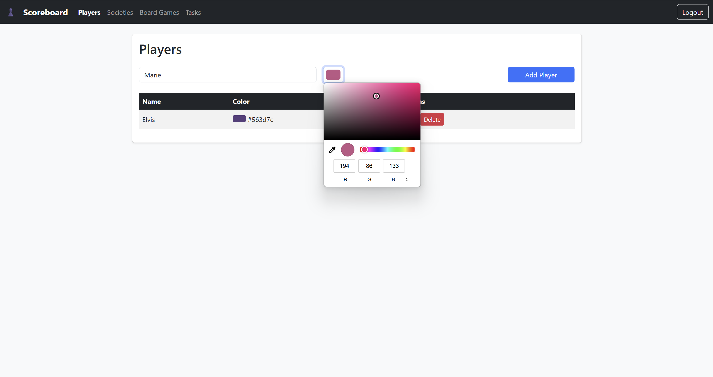
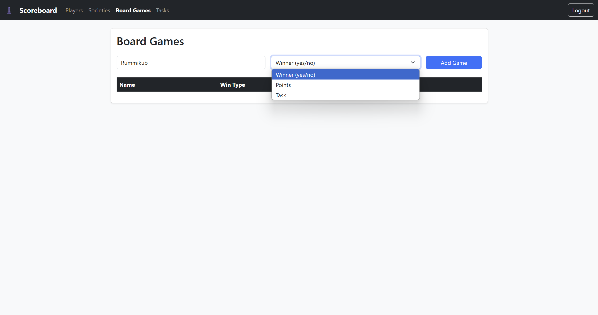
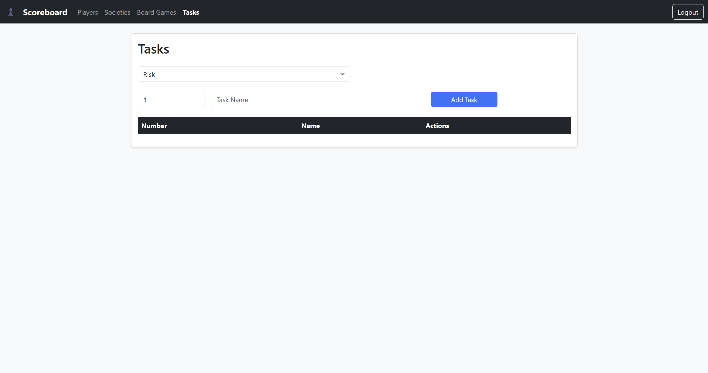
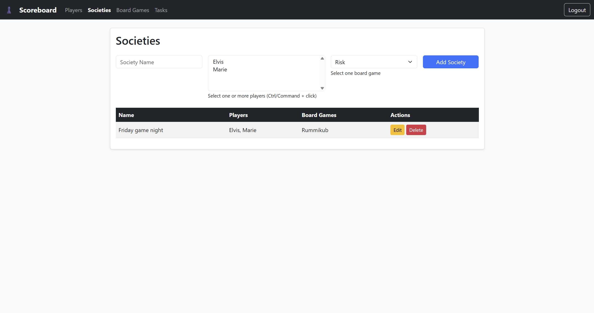
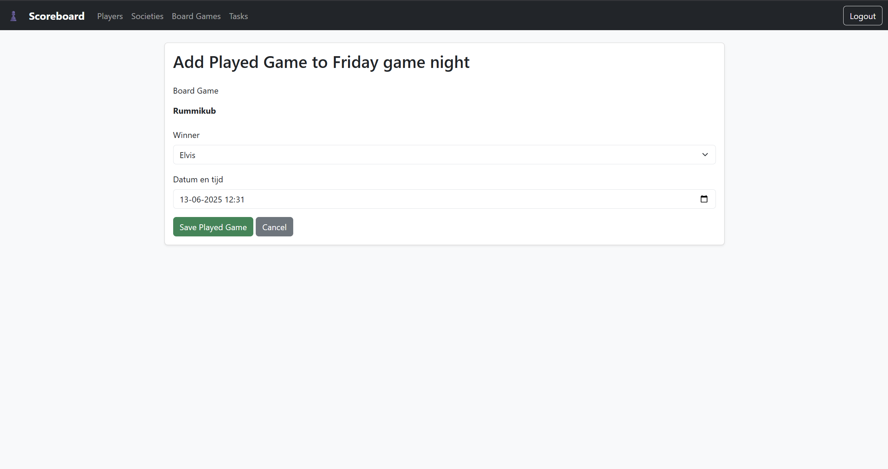
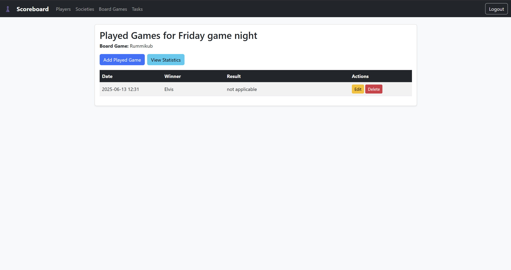

# Scoreboard App

A self-hosted web application to track boardgame scores, players, and statistics for groups of friends or families. Built with FastAPI, Bootstrap, and SQLite.

> [!WARNING]  
> This is for personal development. Don't expose to internet!

## Features
- Admin panel to manage players, boardgames, and tasks
- Create groups ("societies") with selected players and games
- Record played games with different win conditions
- View statistics per group (most wins, most points, most won tasks) filterable by day, week, month, year
- User authentication (admin setup on first run)
- Public view for societies and played games

## Screenshots

### Management Views
  

### Societies & Games
  

### Statistics


## Deployment

### Using Docker Compose

1. Clone this repository:
   ```sh
   git clone https://github.com/Bardesss/Scoreboard.git
   cd Scoreboard
   ```
2. Start the application:
   ```sh
   docker-compose up --build
   ```
3. On first run, you will be prompted to create an admin user.

The app will be available at [http://localhost:6060](http://localhost:6060)

## Updating the Application

To update the application to the latest version:

1. Stop the running containers:
   ```sh
   docker-compose down
   ```

2. Pull the latest changes:
   ```sh
   git pull origin main
   ```

3. Rebuild and start the containers:
   ```sh
   docker-compose up --build
   ```

Your data will be preserved as it is stored in the SQLite database file.

## First Run Instructions

1. Start the application as described above.
2. On the first visit to [http://localhost:6060](http://localhost:6060), you will be redirected to the admin setup page (`/setup`).
3. Create your initial admin account with a username and password.
4. After logging in, you can access all admin features (players, boardgames, tasks, societies, played games, statistics).
5. If you are not logged in, you can only view societies and played games (public view).
6. To log in or out, use the buttons in the top navigation bar.

---

For any issues, make sure your Docker container has write access to the database file (`scoreboard.db`).

More details about configuration and usage will follow as the project is developed. 